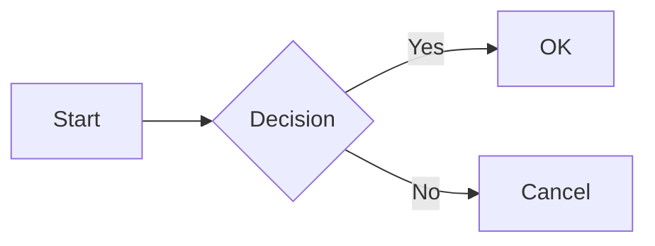

# Mermaid Diagrams Plugin

The **Mermaid Diagrams** plugin is an extension for [Grav CMS](http://github.com/getgrav/grav) that adds [Mermaid](https://mermaid.js.org/) diagram support. Diagrams are rendered client-side in the visitor's browser using Mermaid v11.

Based on [Daniel Flaum's plugin](https://github.com/DanielFlaum/grav-plugin-mermaid-diagrams), with added fenced code block support, a click-to-zoom lightbox, and configurable asset groups for theme compatibility.

# Installation

Copy this repository into your Grav `user/plugins` directory and rename the folder to `mermaid-diagrams`:

    /your/site/grav/user/plugins/mermaid-diagrams

> Note: This plugin requires [Grav](http://github.com/getgrav/grav) and a theme to be installed.

# Usage

The plugin works as soon as it is installed. There are two ways to include Mermaid diagrams in your Grav pages:

## Shortcode Tags

Wrap your diagram code in `[mermaid]` and `[/mermaid]` tags:

```
[mermaid]
graph LR
    A[Start] --> B{Decision}
    B -->|Yes| C[OK]
    B -->|No| D[Cancel]
[/mermaid]
```

## Fenced Code Blocks

Use standard Markdown fenced code blocks with the `mermaid` language identifier:

````

````

Enable this with `fenced_code_blocks: true` in the plugin configuration or via the Admin panel.

## Lightbox

When enabled, clicking on any diagram opens a fullscreen overlay with:

- **Zoom** — scroll or use +/- keys
- **Pan** — click and drag to move around
- **Copy** — copy the diagram SVG to clipboard
- **Expand** — open the diagram in a new browser tab

Enabled by default. Disable with `lightbox: false`.

# Settings

```yaml
enabled: true              # Plugin activation
fenced_code_blocks: false  # Support ```mermaid fenced code blocks
lightbox: true             # Click-to-zoom lightbox for diagrams
js_group: bottom           # JS asset group — use 'bottom' for themes like Helios,
                           # leave empty for themes that use the default pipeline
```

## Theme Compatibility (`js_group`)

Grav themes render JavaScript assets in named groups. Themes like **Helios** render only the `bottom` group (`assets.js('bottom')`), while older themes like **Learn2** render the default group (`assets.js()`).

If your diagrams aren't rendering, check which group your theme uses and set `js_group` accordingly. Use `bottom` for most modern themes.

# Credit

Originally forked from [Aurélien Wolz's](https://github.com/Seao) [Diagram Plugin](https://github.com/Seao/grav-plugin-diagrams), then maintained by [Daniel Flaum](https://github.com/DanielFlaum/grav-plugin-mermaid-diagrams).
